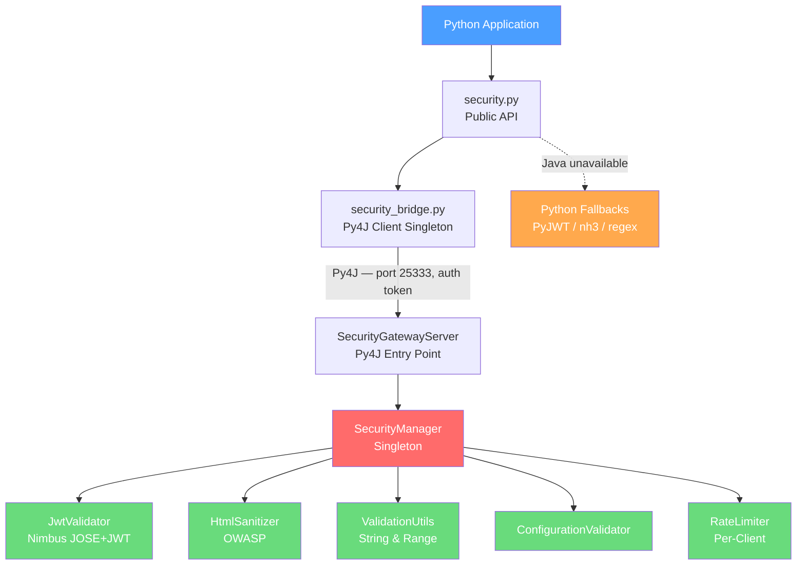

# SecurityBridge

[](https://github.com/Bailie-L/SecurityBridge/actions/workflows/ci.yml)

A cross-language security framework that bridges Python applications to Java security components via [Py4J](https://www.py4j.org/). Delivers enterprise-grade JWT validation, HTML sanitization, and input validation — with automatic Python fallbacks when the Java gateway is unavailable.

---

## Features

### JWT Token Validation
- **HMAC** signing verification (HS256, HS384, HS512)
- **RSA** signing verification (RS256, RS384, RS512)
- Claims validation: `exp` (expiry), `nbf` (not before), `iss` (issuer), `aud` (audience)
- Configurable clock skew tolerance (default 60s)
- Powered by [Nimbus JOSE+JWT](https://connect2id.com/products/nimbus-jose-jwt) on Java, [PyJWT](https://pyjwt.readthedocs.io/) as fallback

### OWASP HTML Sanitization
- **STRICT** — strips all HTML, returns plain text
- **BASIC** — allows formatting tags (`b`, `i`, `em`, `strong`, `p`, `ul`, `ol`, `li`, `blockquote`)
- **RICH** — adds links, images, tables, and headings
- Custom policy registration at runtime
- Audit reports detailing stripped elements and attributes
- Powered by [OWASP Java HTML Sanitizer](https://github.com/OWASP/java-html-sanitizer) on Java, [nh3](https://github.com/messense/nh3) as fallback

### Input Validation
- Alphanumeric validation (letters, digits, underscores)
- Path-safe validation with directory traversal blocking
- Numeric range validation (int and float)
- Configuration validation with allowlist sanitization
- 10,000 character input limit enforced before regex processing

### Security Hardening
- Py4J gateway authenticated via `SECURITYBRIDGE_AUTH_TOKEN` environment variable
- Security toggle requires auth token to modify
- All internal maps bounded with LRU eviction (10K/5K entries) to prevent memory exhaustion
- Per-client rate limiting with thread-safe synchronized access

---

## Architecture



When the Java gateway is running, all operations delegate to the JVM for maximum performance and access to enterprise Java libraries. When it is unavailable, Python fallbacks (PyJWT, nh3, regex) provide identical behaviour so the application never breaks.

---

## Project Structure
```
SecurityBridge/
├── src/
│   ├── java/com/securitybridge/
│   │   ├── SecurityManager.java            # Central coordinator (singleton)
│   │   ├── JwtValidator.java               # JWT validation (Nimbus JOSE)
│   │   ├── HtmlSanitizer.java              # HTML sanitization (OWASP)
│   │   ├── ValidationUtils.java            # Input validators
│   │   ├── ConfigurationValidator.java     # Config validation
│   │   ├── RateLimiter.java                # Per-client rate limiting
│   │   └── bridge/
│   │       └── SecurityGatewayServer.java  # Py4J gateway entry point
│   └── python/
│       ├── security.py                     # Public API with fallbacks
│       ├── security_bridge.py              # Py4J client singleton
│       └── start_security_bridge.py        # Gateway launcher
├── tests/
│   ├── java/com/securitybridge/
│   │   ├── SecurityManagerTest.java        # 30 tests
│   │   ├── JwtValidatorTest.java           # 26 tests
│   │   ├── HtmlSanitizerTest.java          # 36 tests
│   │   ├── ValidationUtilsTest.java        # 23 tests
│   │   └── ConfigurationValidatorTest.java # 12 tests
│   └── python/
│       └── test_security_bridge.py         # 78 tests (+ 3 integration)
├── demo/
│   └── app.py                              # FastAPI demo application
├── docs/
│   └── HANDOVER_FINAL.md                    # Technical handover document
├── build.gradle
├── requirements.txt
├── pyproject.toml
├── settings.gradle
├── libs/
│   └── py4j-0.10.9.9.jar
└── gradlew / gradlew.bat
```

---

## Prerequisites

| Software | Version | Purpose |
|----------|---------|---------|
| Java JDK | 17+ | Java runtime and compiler |
| Python | 3.10+ | Python runtime |
| Gradle | 7.6+ | Java build system (wrapper included) |

---

## Quick Start

### 1. Clone and set up
```bash
git clone https://github.com/Bailie-L/SecurityBridge.git
cd SecurityBridge
python -m venv venv
source venv/bin/activate
pip install -r requirements.txt
```

### 2. Set the auth token
```bash
export SECURITYBRIDGE_AUTH_TOKEN=your-secret-token
```

### 3. Build Java components
```bash
./gradlew compileJava
```

### 4. Run tests
```bash
# Java tests (127 tests)
SECURITYBRIDGE_AUTH_TOKEN=test-token ./gradlew clean test

# Python tests (78 passed, 3 integration skipped without gateway)
pytest tests/python/ -v
```

### 5. Run the FastAPI demo
```bash
DEMO_JWT_SECRET=your-jwt-secret uvicorn demo.app:app --host 0.0.0.0 --port 8000
```

Then visit `http://localhost:8000/docs` for the interactive Swagger UI.

---

## Usage

### Python API
```python
from security import get_instance

sec = get_instance()

# JWT validation (HMAC)
claims = sec.validate_jwt(token, secret)
claims = sec.validate_jwt(token, secret, expected_issuer="auth-svc", expected_audience="my-api")

# HTML sanitization
safe = sec.sanitize_html(untrusted_html, "STRICT")   # plain text only
safe = sec.sanitize_html(untrusted_html, "BASIC")    # formatting tags
safe = sec.sanitize_html(untrusted_html, "RICH")     # + links, images, tables

# Input validation
clean = sec.validate_string(user_input, "username", "alphanumeric")
path  = sec.validate_string(file_path, "filepath", "path")
port  = sec.validate_range(value, 1, 65535, "port")

# Security events
sec.record_security_event("auth_failure", "Bad password for user X", "WARNING")
```

### Java API
```java
SecurityManager sm = SecurityManager.getInstance();

// JWT validation
Map<String, Object> claims = sm.validateJwt(token, secret);
Map<String, Object> claims = sm.validateJwt(token, secret, "auth-svc", "my-api");
Map<String, Object> claims = sm.validateJwtRsa(token, publicKeyPem);

// HTML sanitization
String safe = sm.sanitizeHtml(html, "STRICT");
HtmlSanitizer.SanitizationResult result = sm.sanitizeHtmlWithReport(html, "RICH");
result.getSanitizedHtml();
result.getStrippedElements();
result.wasModified();

// Input validation
String clean = sm.validateString(input, "username", "alphanumeric");
```

### FastAPI Demo Endpoints

| Method | Path | Description |
|--------|------|-------------|
| `GET` | `/health` | Bridge status and Java availability |
| `POST` | `/auth/verify` | Validate a JWT and return claims |
| `POST` | `/protected` | Protected route (requires Bearer token) |
| `POST` | `/sanitize` | Sanitize HTML with a specified policy |
| `POST` | `/validate` | Validate a string (alphanumeric, path, default) |
| `POST` | `/validate/range` | Validate a numeric value within a range |

---

## Test Coverage

| Suite | Files | Tests | Passed | Skipped |
|-------|-------|-------|--------|---------|
| Java | 5 | 127 | 127 | 0 |
| Python | 1 | 81 | 78 | 3 |
| **Total** | **6** | **208** | **205** | **3** |

The 3 Python skips are integration tests that require a running Java gateway (`@pytest.mark.integration`).

---

## Dependencies

### Java (via Gradle)

| Library | Version | Purpose |
|---------|---------|---------|
| Py4J | 0.10.9.9 | Python-Java bridge |
| Nimbus JOSE+JWT | 10.7 | JWT token validation |
| OWASP HTML Sanitizer | 20260102.1 | HTML/XSS sanitization |
| JUnit 5 | 5.9.2 | Testing |

### Python (via pip)

| Library | Version | Purpose |
|---------|---------|---------|
| py4j | 0.10.9.9 | Python-Java bridge |
| PyJWT | ≥2.8.0 | JWT fallback |
| nh3 | ≥0.2.15 | HTML sanitization fallback |
| psutil | ≥5.9.0 | Process management |
| FastAPI | ≥0.110.0 | Demo application |
| uvicorn | ≥0.29.0 | ASGI server |
| pytest | ≥8.0.0 | Testing |

---

## Security Measures

- **Authenticated gateway**: Py4J connection requires a shared `SECURITYBRIDGE_AUTH_TOKEN`
- **Auth-gated toggle**: `setSecurityEnabled()` requires matching token — cannot be disabled remotely
- **Path traversal protection**: `..` sequences blocked before regex evaluation
- **Bounded memory**: All internal maps use LRU eviction (5K–10K entries)
- **Input length limits**: 10,000 chars for strings, 100,000 chars for HTML
- **Thread safety**: Singleton with double-checked locking, `Collections.synchronizedMap`, `ConcurrentHashMap`, explicit synchronized blocks
- **Graceful shutdown**: JVM shutdown hook for clean gateway termination

---

## License

MIT
